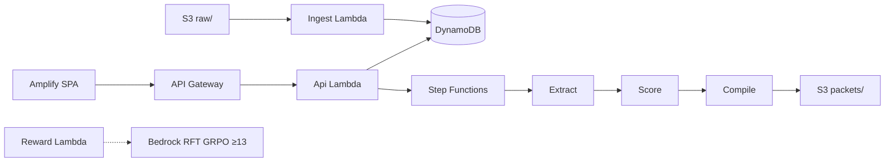

# CasePacket

**LE dark-web intel triage → court-friendly case packet on AWS**  
First Commit / Bharat Builds **Ship It** · fixtures only · not a chatbot · not a live Tor crawler

> SIMULATED FIXTURE DATA — NOT OPERATIONAL INTEL

Inspired by KAVACH Cyph3r research ([`Executive Summary.pdf`](./Executive%20Summary.pdf)): collect → normalize → correlate/score → **legally credible report**.  
“CID Track” is undocumented publicly — we do not claim it.

## Architecture



Local path (no AWS): `uvicorn local.server:app` + Vite — same analyst flow.

## Docs

| Doc | Purpose |
|-----|---------|
| [docs/CasePacket-PRD.md](docs/CasePacket-PRD.md) | Full PRD |
| [docs/plan.md](docs/plan.md) | Build phases |
| [docs/frontend.md](docs/frontend.md) / [backend.md](docs/backend.md) / [ml.md](docs/ml.md) | Specs |
| [docs/demo.md](docs/demo.md) | 3-min demo script |
| [docs/resources.md](docs/resources.md) | AWS Builder Center + Trendshift refs |

Cursor rule: `.cursor/rules/casepacket.mdc`

## Quick start (local — no AWS)

All case content lives in `fixtures/*.json` or arrives via `POST /ingest`.  
Risk weights live in `config/risk_rules.yaml`. API URL/key come from env only.

```bash
# one-shot smoke (API must be up)
pip install -r local/requirements.txt
uvicorn local.server:app --host 127.0.0.1 --port 8000
# other terminal:
python scripts/smoke_e2e.py

# frontend
cd web
cp .env.example .env   # VITE_API_URL=http://127.0.0.1:8000
npm i && npm run dev   # http://127.0.0.1:5173
```

Windows helper: `powershell -File scripts/run_local.ps1`

**Analyst flow:** open queue → Reload fixtures → open case → Generate CasePacket → Download JSON.

## Deploy (Ship It / AWS)

```bash
sam build
sam deploy --guided   # DemoApiKey via parameter (not in app code), region ap-south-1

python scripts/seed.py --api https://YOUR_API --api-key YOUR_KEY
# or: python scripts/seed.py --bucket YOUR_RAW_BUCKET

cd web
# .env: VITE_API_URL=https://YOUR_API  VITE_API_KEY=YOUR_KEY
npm run build   # → Amplify Hosting (web/amplify.yml)

# GRPO dataset (≥12 prompts from fixtures)
python scripts/build_grpo_dataset.py
# aws s3 cp ml/datasets/grpo_train.jsonl s3://$RAW/ml/grpo/train.jsonl
# Bedrock RFT: RewardFunctionArn output, group_size ≥ 13
```

## Cost estimate (`ap-south-1`, light demo)

| Service | Rough monthly @ hackathon traffic |
|---------|-----------------------------------|
| Lambda + API GW | &lt; $1 |
| DynamoDB on-demand | &lt; $1 |
| S3 + Step Functions | &lt; $1 |
| Amplify Hosting | free tier / few $ |
| Bedrock RFT (optional) | job-time only — disable for free-tier demo |

Weekend judge load stays well under **~$5** without a long RFT run.

## Trendshift / OSS we borrowed ideas from

- [security-audit-skill](https://github.com/cloudflare/security-audit-skill) — machine-readable `findings[]` in packets  
- [brag](https://github.com/latent-spaces/brag) — optional Ship It demo video  
- [Trendshift](https://trendshift.io/) — discovery  

## Legal

Educational / hackathon demo. No live onion crawling. Comply with IT Act / DPDP when handling real data (we don’t).

## License

MIT (hackathon demo code)
