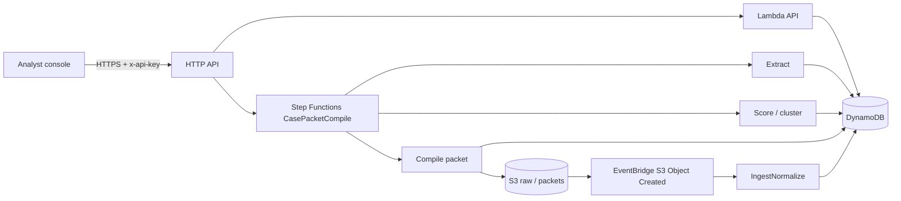

# CasePacket

**Dark-web *signal* → LE-ready *case packet* on AWS.**  
First Commit / Bharat Builds — Ship It. Simulated fixtures only. No live Tor.

Indian cyber cells get noisy marketplace chatter (fake KYC, UPI mules, credential dumps). Today that becomes a chatbot summary or a WhatsApp forward — no entities, no hash trail, no file. Enterprise TIPs (OpenCTI / MISP) take weeks to stand up.

CasePacket is the thin slice: **ingest → extract → score → cluster → compile**. The product is the packet, not a chat box.

All listings are fake (`simulated: true`). The UI banner never turns off.

---

## What you are looking at

```
fixtures/*.json          20 fake Indian-theme listings
        │
        ▼
   ingest + SHA-256      immutable raw copy (S3 or .local/s3/raw)
        │
        ▼
 regex NER               phone · email · URL · wallet · @handle
        │
        ▼
 risk rules              0–100 from category + keywords + entity density
        │
        ▼
 cluster                 shared phone / email / wallet → CL-xxxxxx
        │
        ▼
 Step Functions          extract → score → render STIX-lite JSON → packets/
 (local: same steps, synchronous)
        │
        ▼
 analyst console         queue → case → Generate packet → download JSON
```

**Invariant:** a packet still compiles if Bedrock is off. Enrichment falls back to rules and marks `enrichment: degraded` only if you *enable* Bedrock and it fails.

---

## How to run it (you, today)

You already have **Python** (`py`) and **Node**. You do **not** need AWS, SAM, or Docker for the full demo.

### 1. Seed the 20 cases

```powershell
cd "C:\Users\tanis\Desktop\Bharat Build\BHARAT-BUILDS"
py scripts/seed.py
```

### 2. Start the API (leave this terminal open)

```powershell
py scripts/local_server.py
```

Check: [http://127.0.0.1:8080/healthz](http://127.0.0.1:8080/healthz) should return `"status": "ok"`.

### 3. Start the console (second terminal)

```powershell
cd "C:\Users\tanis\Desktop\Bharat Build\BHARAT-BUILDS\web"
npm install
npm run dev
```

Open **[http://127.0.0.1:5173](http://127.0.0.1:5173)**.

Demo API key (already wired in the UI): `casepacket-demo-key`.

### 4. Click through (2–3 min demo)

1. **Dashboard** — priority triage (High / Medium / Low pills).
2. **Cases** → open **CASE-001**. Tabs: Overview · Entities · Linked Posts · Timeline.
3. Follow a **linked case** (CASE-001 ↔ CASE-007 via shared phone).
4. **Generate Packet** → staged compile modal → JSON with `disclaimer`, `chain_of_custody`, STIX-lite `objects[]`.
5. **Reports** / **AWS Pipeline** for packet list + Step Functions demo graph.

Other built-in clusters:

| Shared entity | Cases |
|---------------|--------|
| `+91-90000-00001` | CASE-001, CASE-007 |
| `dump_broker@example.invalid` | CASE-002, CASE-012 |
| `1FakeWalletDemo000000000000000001` | CASE-005, CASE-015 |

### Tests

```powershell
py -m unittest tests/test_pipeline.py
```

---

## How it works (internals)

| Piece | Role | LLM? |
|-------|------|------|
| `src/shared/pipeline.py` | Ingest, extract, score, cluster, compile | No |
| `src/shared/ner.py` | Regex observables | No |
| `src/shared/scoring.py` | Risk 0–100 | No |
| `src/shared/packet.py` | CasePacket JSON + STIX-lite `objects[]` | No |
| `scripts/local_server.py` | Same HTTP API as Lambda | No |
| `src/api/handler.py` | API Gateway adapter | No |
| Step Functions `CasePacketCompile` | Auditable compile on AWS | No |
| `src/shared/bedrock.py` | Optional summary | Optional |

**Local vs AWS:** if `CASEPACKET_LOCAL=1` (default on your laptop), data lives in `.local/`. If `TABLE_NAME` + `BUCKET_NAME` are set (SAM), the same code uses DynamoDB + S3 + Step Functions.

**Auth:** `x-api-key` on every route except `/healthz`.

| Method | Path | What |
|--------|------|------|
| GET | `/healthz` | Liveness + store/S3 checks |
| GET | `/cases` | Risk-sorted queue |
| GET | `/cases/{id}` | Excerpt, entities, linked ids |
| POST | `/cases/{id}/packet` | Compile (local sync / SF start) |
| GET | `/cases/{id}/packet` | Metadata + download URL |
| POST | `/ingest` | Push one more simulated listing |

---

## What you need to do next

**For local use / rehearsal — nothing else.** Seed, start API, start web.

**For First Commit “live URL + AWS evidence”:**

1. Create an AWS account (or use the workshop one). Region **`ap-south-1`**.
2. Install [AWS CLI](https://docs.aws.amazon.com/cli/latest/userguide/getting-started-install.html) and [SAM CLI](https://docs.aws.amazon.com/serverless-application-model/latest/developerguide/install-sam-cli.html).
3. `aws configure` with an IAM user that can create Lambda, API Gateway, DynamoDB, S3, Step Functions, IAM roles.
4. Deploy:

```powershell
sam build
sam deploy --guided
```

5. Note outputs `ApiUrl`, `BucketName`, `StateMachineArn`.
6. Point the console at the live API:

```powershell
cd web
# web/.env
# VITE_API_URL=https://xxxx.execute-api.ap-south-1.amazonaws.com
# VITE_API_KEY=the-key-you-set
npm run build
```

Host `web/dist` on S3 + CloudFront or Amplify. Put that URL in this README.

7. Seed on AWS: put the files in `fixtures/` to `s3://$BucketName/raw/2026/09/` **or** `POST /ingest` each file with the API key.

8. Record the 3-minute video: queue → CASE-001 → Generate → JSON → AWS console (Step Functions graph, S3 `raw/` + `packets/`, CloudWatch).

**Do not** add live onion crawls, exploit kits, or real PII.

---

## Architecture



**Rough weekend cost (`ap-south-1`, light traffic):** DynamoDB on-demand + Lambda + S3 + HTTP API = pennies. CloudFront free-tier friendly. Bedrock is off by default (`EnableBedrock=0`). Stay well under $15.

---

## Ethics

Educational / LE-analyst **workflow** demo only. Every fixture is synthetic. Rotate the demo API key if you leave a public URL up after the event.
